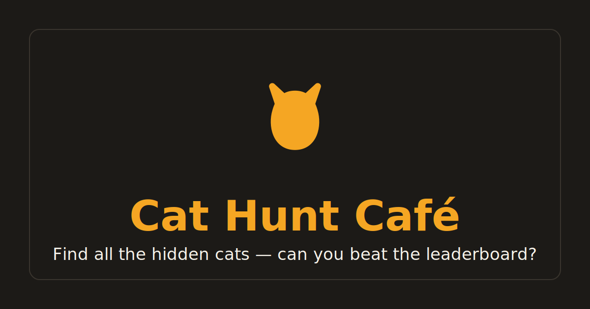

# Cat Hunt Café 🐱☕

A mobile-first **hidden-object game**: find all the cats camouflaged in a
hand-drawn black-and-white café scene. Built with React + Vite + Tailwind.



## Features

- 🎨 **Hand-drawn SVG café scenes** (coloring-book line art) across **2 levels**:
  - **Level 1 – Cozy Café** (Easy): 15 cats, a gentle warm-up
  - **Level 2 – Busy Bistro** (Hard): 20 cats hidden in a far busier scene
    (double shelving, long counter, cat tree, reading nook, street window…)
- 👆 **Tap-to-find** with a forgiving hit radius; cats glow amber + bounce when found
- ⏱ Live timer, score counter, animated found-cat strip
- 💡 **3 hints** (briefly highlights an unfound cat) · 🔊 synthesized chime / meow / café ambience
- 🏆 **Top-10 leaderboard** (ranked by cats found, then fastest time)
- 🎁 **Admin panel** at `/admin` — prize CRUD, date-ranged prize schedule, winner
  selection (manual or auto-#1), trophy badges, **CSV export**
- 🎉 Confetti win screen, **native share**, **PWA** (add to home screen)
- 📱 Fully responsive, finger-friendly tap targets

## Quick start

```bash
npm install
npm run dev      # http://localhost:5173
```

Build & preview production:

```bash
npm run build
npm run preview
```

## How it plays

1. **Home** → Start Game
2. **Game** → tap the cats hiding on shelves, in plants, on the counter, etc.
3. **End** → confetti, enter your name, submit
4. **Leaderboard** → top 10, active prize highlighted, play again
5. **Admin** (`/admin`, password `catcafe` by default) → manage prizes & winners

## Backend

The app ships with a **zero-config localStorage backend** so it runs instantly.
A drop-in **Firebase/Firestore** adapter implementing the same interface is
included. To switch:

```bash
npm i firebase
cp .env.example .env.local   # fill in your Firebase keys
# set VITE_BACKEND=firebase in .env.local
```

Both adapters live in [`src/storage/`](src/storage) behind a single facade
([`src/storage/index.js`](src/storage/index.js)), so no UI code changes.

> ⚠️ Change `VITE_ADMIN_PASSWORD` before deploying. The password only gates the
> admin **UI** — for a real public deployment, protect prize writes with
> Firestore security rules / a Cloud Function.

## Deploy

Static SPA — deploys as-is to **Vercel** (`vercel.json` included) or **Netlify**
(`public/_redirects` included). Build command `npm run build`, output `dist/`.

## Levels & customizing the cats

Levels are registered in [`src/data/levels.js`](src/data/levels.js) — each entry
is just a `Background` component + a `cats` array. **Adding a Level 3** is one
new entry there plus a new background + cats file.

- Cat placements: [`src/data/cats.js`](src/data/cats.js) (L1),
  [`src/data/cats2.js`](src/data/cats2.js) (L2)
- Pose art: [`src/components/Cat.jsx`](src/components/Cat.jsx)
- Scenes: [`CafeBackground.jsx`](src/components/CafeBackground.jsx) (L1),
  [`CafeBackground2.jsx`](src/components/CafeBackground2.jsx) (L2), with shared
  brick/light primitives in [`sceneParts.jsx`](src/components/sceneParts.jsx)

All coordinates are in the scene's `1200 × 800` viewBox. The leaderboard is
tracked **per level** (tabs on the leaderboard screen).
```
